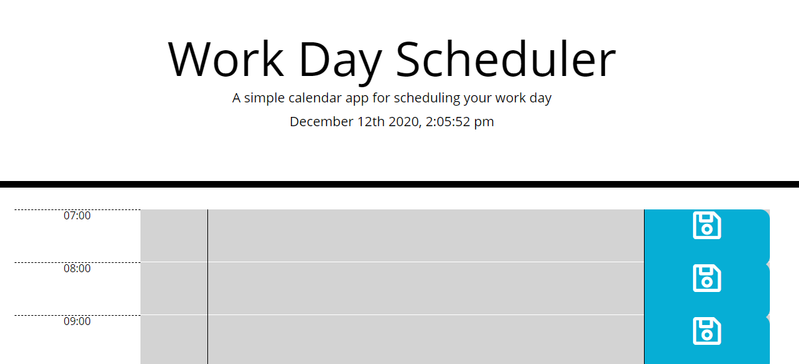
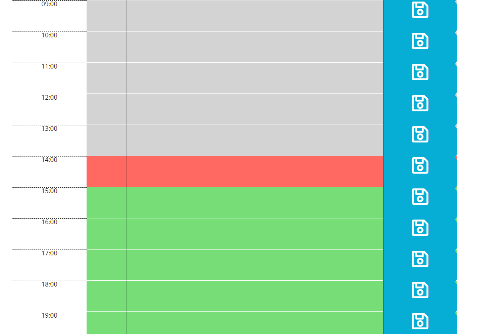
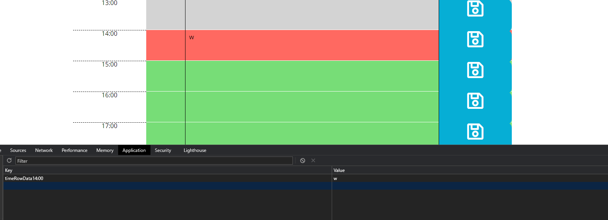

# Jack-s-Work-Day-Scheduler

## Purpose of this Project
The purpose of this project was to build a work day scheduler, built dynamically with JavaScript, along with local storage functionality.
## Goals of this Project
- Use JavaScript to build the webpage dynamically;
- Utilise the moment.js library for all time-related occurrences in JavaScript.
- Use local storage to both store and retrive saved text from the work schedule.
## Problems encountered in this Project
The moment.js library took a bit to understand, as the documentation was a tad bit confusing to me. I did eventually understand enough of the library to finish the project. One major problem I have been unable to find a fix for, is to have the colours of each time row update dynamically - as for some reason the if statements responsible for assigning the colours won't work outside of the for loop creating the rows.

## Screenshots of Completed Project
###### Top of the Scheduler, displaying the constantly updating time

###### Screenshot of the scheduler showing off the three variants of coloured rows - past, present & future

###### Screenshot showing that the save button works and saves the text in the "14:00" row to the local storage

## Links to GitHub Repository & Live Project
### https://github.com/Foggles/Jack-s-Work-Day-Scheduler
### https://foggles.github.io/Jack-s-Work-Day-Scheduler/